# Missal Romano

## O Motor da Liturgia

Como marcar e manusear o Missal para Acólitos 

<!--O que é a Liturgia? Para que serve? Não podemos simplesmente rezar em casa e pronto?-->

---

# O que é a Liturgia? (CIC 1066-1075)

>Originariamente, a palavra «liturgia» significa «obra pública», «serviço por parte dele em favor do povo». 
>Na tradição cristã, quer dizer que o povo de Deus toma parte na «obra de Deus». Pela liturgia, Cristo, nosso Redentor e Sumo-Sacerdote, continua na sua Igreja, com ela e por ela, a obra da nossa redenção. (CIC 1069)

* Participação do povo de Deus na obra de Deus.
* É a celebração dos mistérios de Cristo, especialmente o mistério pascal (CIC 1067)
* Exercício da função sacerdotal de Cristo e do seu Corpo Místico através de sinais sensíveis (CIC 1070)
* Cristo age com a Igreja e por ela na obra da redenção (CIC 1069)

<!--É através da liturgia que encontramos as graças que Jesus, através do Espírito Santo, nos deixou-->
<!--O que é a obra de Deus? É tudo, mas no contexto daquilo que o catecismo chama de economia da salvação, portanto da forma como Deus salvou o mundo e nos redimiu, tornou possível vivermos em relação e ligados a Ele-->
  
---

## Com a finalidade de:

* **Culto a Deus**: Louvor, adoração, ação de graças.
* **Santificação dos homens**: Comunicação da graça, transformação espiritual.
* **Memorial do Mistério Pascal**: Atualização da paixão, morte e ressurreição de Cristo.
* **Unidade da Igreja**: Reunião dos fiéis como Corpo de Cristo.

<!--E é através da liturgia que entramos e participamos naquilo que Ele fez por nós. É importante compreender isto e vamos usar o termo Liturgia montes de vezes-->
<!--Então é a participação na obra de Deus com objetivo de louvor, redenção, santificação e reconciliação.-->
<!--E sempre que participamos nos sacramentos participamos na a obra de Deus, mais concretamente e neste contexto no sacramento da Eucaristia-->

---

# A Missa (CIC 1322-1419) (IGMR)

>A Eucaristia é o memorial da Páscoa de Cristo, isto é, da obra da salvação realizada pela vida, morte e ressurreição de Cristo, obra tornada presente pela ação litúrgica. (CIC 1409)

>Na Missa ou Ceia do Senhor, o povo de Deus é convocado e reunido, sob a presidência do sacerdote que faz as vezes de Cristo, para celebrar o memorial do Senhor ou sacrifício eucarístico. A esta assembleia local da santa Igreja se aplica eminentemente a promessa de Cristo: “Onde estiverem dois ou três reunidos em meu nome, aí estou Eu no meio deles” (Mt 18, 20). Com efeito, na celebração da Missa, em que se perpetua o sacrifício da cruz, Cristo está realmente presente: na própria assembleia congregada em seu nome, na pessoa do ministro, na sua palavra e, ainda, de uma forma substancial e permanente, sob as espécies eucarísticas. (IGMR 27)

<!--O que é a Eucaristia? É a constante renovação do sacrifício do Filho ao Pai pelo poder do Espírito Santo. E nós podemos e devemos participar nesta liturgia-->
<!--Muitas vezes somos meros observadores mas somos chamados a ser participantes plenos-->
<!--E para participar plenamente temos que perceber o que está a acontecer e participar de todas as maneiras possíveis, de acordo com o ministério litúrgico de cada um-->
<!--Qual o nosso ministério liturgico? Que outros existem? Ministro Ordenado/Sacerdote, leitor, cantor, sacristão, ofertório, acolhimento, MEC-->

---

## Nomes da Missa

É chamada também de:
* **Eucaristia** (CIC 1328).
* **Ceia do Senhor** (CIC 1329).
* **Assembleia eucarística** (CIC 1329).
* **Memorial da Paixão do Senhor** (CIC 1330).
* **Santo Sacrifício/Sacrifício da Missa** (CIC 1330).
* **Santa e Divina Liturgia** (CIC 1330).
* **Sacramento do Amor**.

<!--Cada nome da Missa reflete um aspecto particular da sua riqueza e profundidade, ajudando-nos a compreender melhor o mistério que celebramos.-->
<!--Sacramento é um sinal sensível instituído por NSJC e confiado à Igreja para produzir a graça nas nossas almas e santificá-las-->

---

## Natureza e Significado

* **Memorial da Páscoa de Cristo**: torna presente e renova o único sacrifício de Cristo (CIC 1362-1364).
* **Sacrifício e Comunhão**: une os fiéis a Cristo e entre si (CIC 1329).
* **Fonte e ápice da vida cristã**: “A Eucaristia é fonte e ápice de toda a vida cristã” (CIC 1324).

## Finalidade

* **Santificação dos fiéis** (CIC 1391-1397).
* **Unidade do Corpo de Cristo** (CIC 1396).
* **Alimento Espiritual**: fortalece a vida cristã (CIC 1392).

<!--Todos participam pela oração e entrega dos seus corações no sacrifício da Eucaristia em conjunto com o Ministro Ordenado e Jesus Cristo, Sumo Sacerdote-->
<!--Quem preside à Eucaristia? É, de forma invisível, Jesus Cristo. O ministro ordenado preside na sua pessoa, in persona Christi Capitis-->
<!--Então, sempre que vamos à missa participamos nesta obra de Deus. Liturgia é isto-->
<!--Mas então, como celebrar a Missa?-->

---

# O Missal Romano

O Missal é o livro litúrgico que contém todas as orações, fórmulas e orientações necessárias para a celebração da Santa Missa no rito romano. 
Inclui:
* Textos fixos da Missa (como o Ordinário: Kyrie, Gloria, Credo, etc.).
* Orações próprias para cada dia, tempo litúrgico ou circunstância (orações do dia, prefácios, bênçãos).
* Ritos e normas que orientam a celebração, garantindo unidade e fidelidade à tradição da Igreja.
* Indicações (rubricas) para ministros e assembleia, como gestos, posturas e momentos de silêncio.

O Missal é, portanto, o instrumento oficial que assegura que a Eucaristia é celebrada de forma ordenada e conforme as normas da Igreja.

---

# História do Missal Romano

## Antes do Concílio de Trento (1570)

* Utilizavam-se vários livros para a Missa (sacramentário, livros de leitura, antifonário).  
* Surgiram manuscritos que unificavam esses conteúdos, chamados *Missale Plenum* (Missal Completo).  
* São Francisco de Assis adotou o missal da corte papal para os franciscanos.  
* A imprensa ajudou a difundir versões variadas, o que levou à necessidade de uniformização.

---

## De 1570 a 1960

* O papa São Pio V publicou a primeira edição típica oficial em 1570, após o Concílio de Trento.  
* Houve revisões por Clemente VIII (1604), Urbano VIII (1634), Leão XIII (1884), São Pio X (1920) e Pio XII (1955).  
* Pio XII introduziu mudanças significativas, como o uso das línguas vernáculas na Vigília Pascal.  
* João XXIII publicou a edição de 1962, com alterações como a inclusão de São José no cânone da Missa.

<!--O Concilio de Trento foi um marco importante na história da Igreja no que diz respeito à liturgia.-->

---

## Revisão após o Concílio Vaticano II

* Entre 1965 e 1967, mudanças foram feitas conforme o documento *Sacrosanctum Concilium*.  
* Em 1969, São Paulo VI promulgou uma nova edição com grandes reformas (Constituição Apostólica *Missale Romanum*):  
  * Introdução de novas Orações Eucarísticas.  
  * Simplificação dos ritos.  
  * Aumento das leituras bíblicas na Missa.  
  * Introdução dos ciclos litúrgicos trienais e bienais.

---

## Revisões posteriores

* Edições típicas foram publicadas em 1970, 1975 e 2002 (esta última aprovada por São João Paulo II).  
* Bento XVI autorizou correções e acréscimos em 2008.  
* Traduções vernáculas foram feitas por conferências episcopais, como a portuguesa (2022).

---

# Outros Livros Litúrgicos

* Missal da Presidência
* Lecionário
* Evangeliário
* Oração Universal
* Pontifical

---

# O Acólito e o Missal

O acólito, ao servir o Missal, participa na oração da Igreja de modo **silencioso, mas essencial**.

É um ministério de **humildade e precisão**: o livro sagrado passa pelas suas mãos para chegar à oração do povo.

O acólito **não é protagonista**.\
Ele é servidor das ações, das palavras e dos gestos.

Quando serve o Missal, o acólito permite que o sacerdote possa rezar com liberdade, dignidade de modo a ser espelho da Graça Divina durante a celebração.

---

# Como está organizado o Missal?

* Instrução Geral do Missal Romano (IGMR)
* Próprio do Tempo
* Ordinário da Missa
* Próprio dos Santos
* Missas Comuns
* Missas Rituais
* Missas e Orações para diversas necessidades
* Missas Votivas
* Missas dos Defuntos
* Apêndices e Índices

---

## Fitas e pegas

O Missal tem **6 fitas** para marcação dos momentos da celebração.

Tem também **36 pegas** (8 claras e 28 escuras) para acesso rápido a vários momentos e orações.

## Rubricas

As rubricas são as notas a vermelho (do latim *ruber*, “vermelho”), que indicam o que se faz e não o que se diz.

O acólito deve saber lê-las, porque nelas se encontram as indicações que tornam os gestos claros e belos.

---

# Próprio do Tempo

* Advento
* Natal
* Quaresma
* Páscoa
* Tempo Comum
* Solenidades do Senhor

---

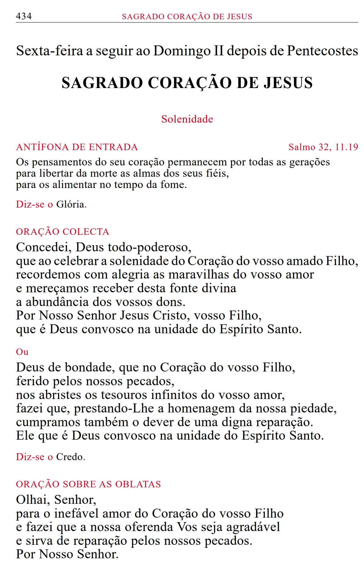

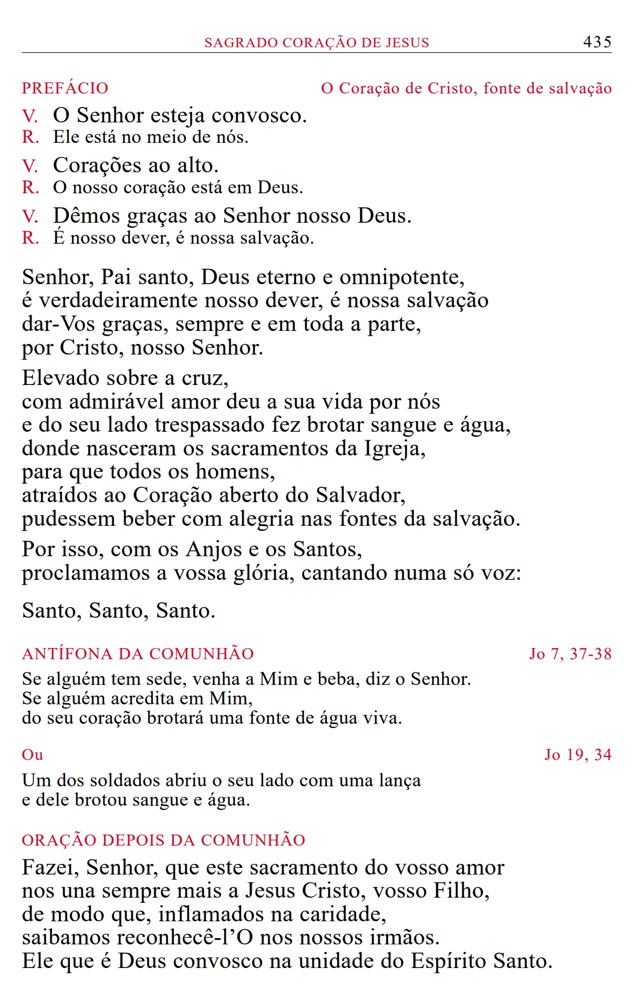

---

# Próprio dos Santos

* Santos fixos no calendário
* Santos móveis (dependem da Páscoa)

---

# Missas Comuns

* Comum da Dedicação de uma Igreja
* Comum de Nossa Senhora
* Comum dos Mártires
* Comum dos Pastores da Igreja
* Comum dos Doutores da Igreja
* Comum das Virgens
* Comum dos Santos e das Santas
* Antífonas de entrada para as festas e solenidades
  
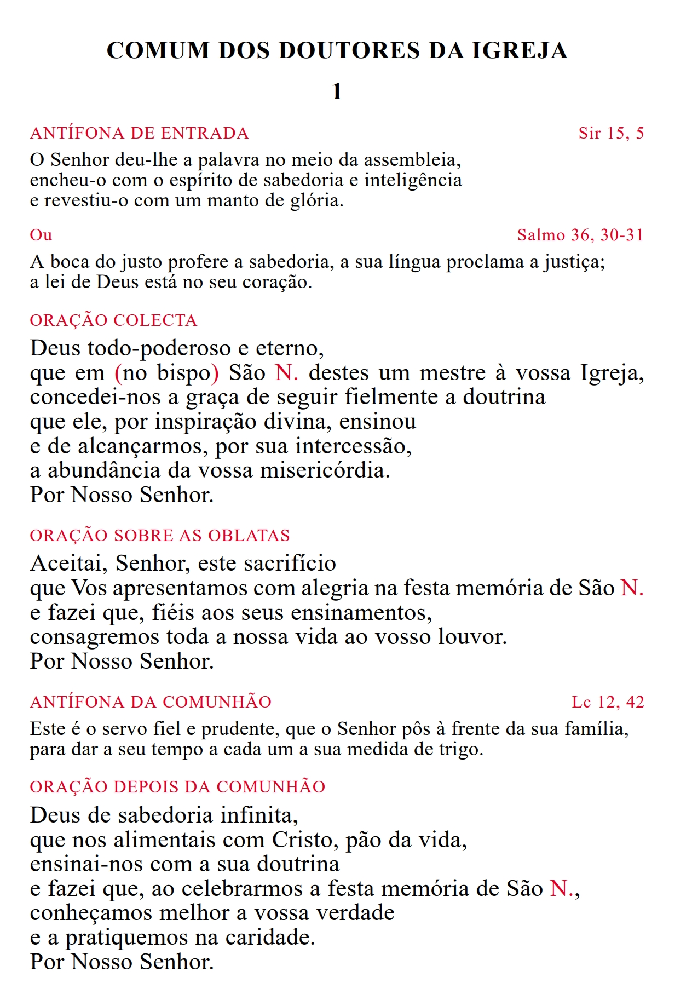

---

---

## O que podemos encontrar nas páginas do Temporal/Santoral/Comum?

* Orações Presidenciais
  * Oração Coleta
  * Oração sobre as Oblatas
  * Oração depois da Comunhão

* Prefácio

* Antífonas e rubricas específicas

---

# Ordinário da Missa

Quatro partes principais, conforme o IGMR 28:

* Ritos Iniciais
* Liturgia da Palavra
* Liturgia Eucarística
* Ritos Finais

---

# Ritos Iniciais (IGMR 46–54)

Têm como objetivo reunir a assembleia e prepará-la para celebrar dignamente os mistérios da fé. 

Incluem gestos e orações que ajudam os fiéis a entrar em atitude de oração, reconhecer a presença de Deus e pedir perdão pelos pecados.

Estes ritos criam unidade entre os participantes e introduzem o tema da celebração.

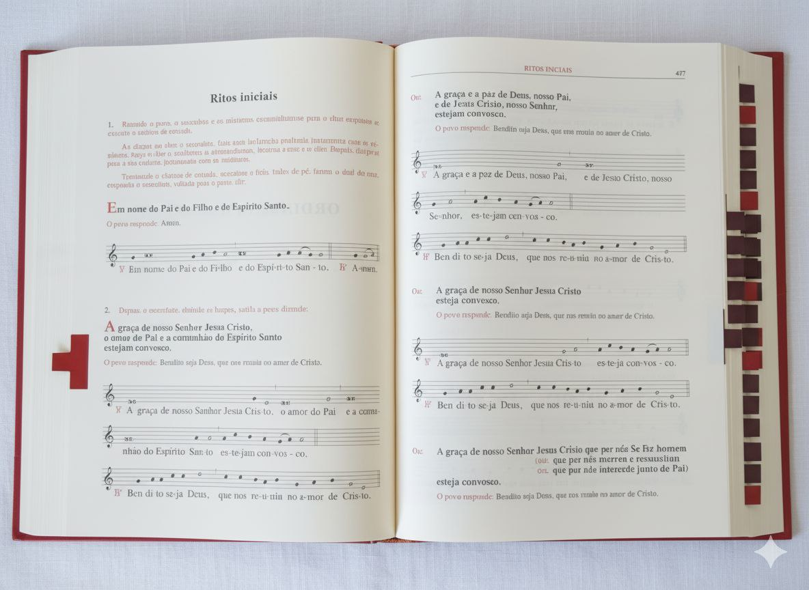

---

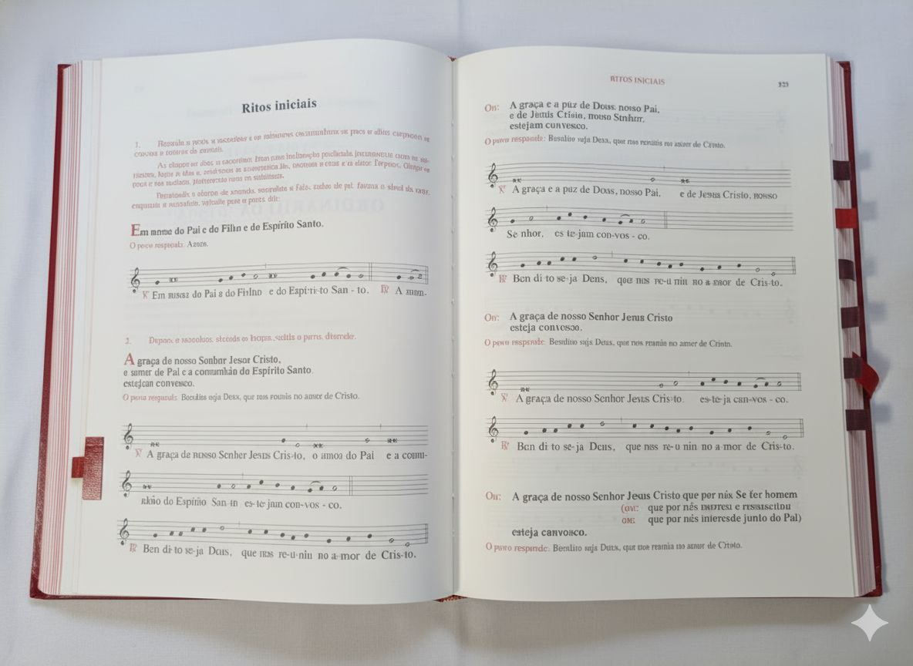

---

# Entrada, Saudação do Altar e da Assembleia (IGMR 47-50)

---

# Ato Penitencial e Kyrie Eleison (IGMR 51-52)

Momento em que a assembleia reconhece as próprias faltas diante de Deus, pede perdão e misericórdia. 

É um gesto de humildade e preparação para participar dignamente na celebração. 

Pode incluir fórmulas dialogadas.

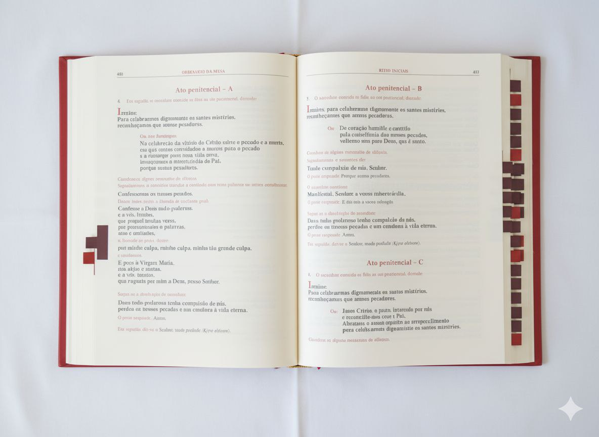

---

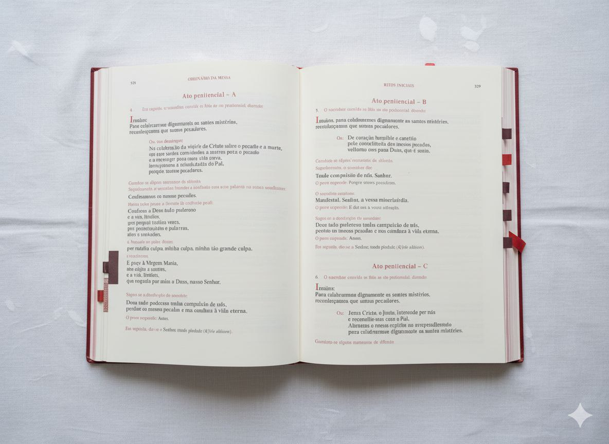

---

# Glória (IGMR 53)

Hino de louvor dirigido a Deus Pai, Filho e Espírito Santo. 

É uma oração antiga da Igreja, recitada ou cantada nos domingos (exceto no Advento e na Quaresma) e nas solenidades. 

Expressa alegria e gratidão pela salvação.

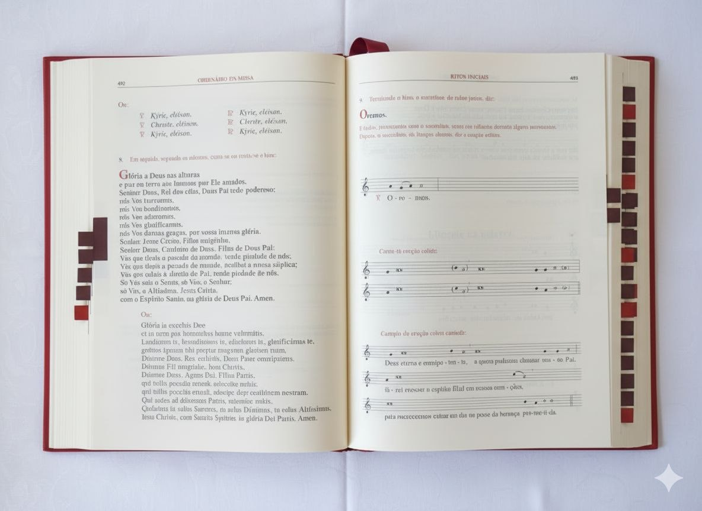

---

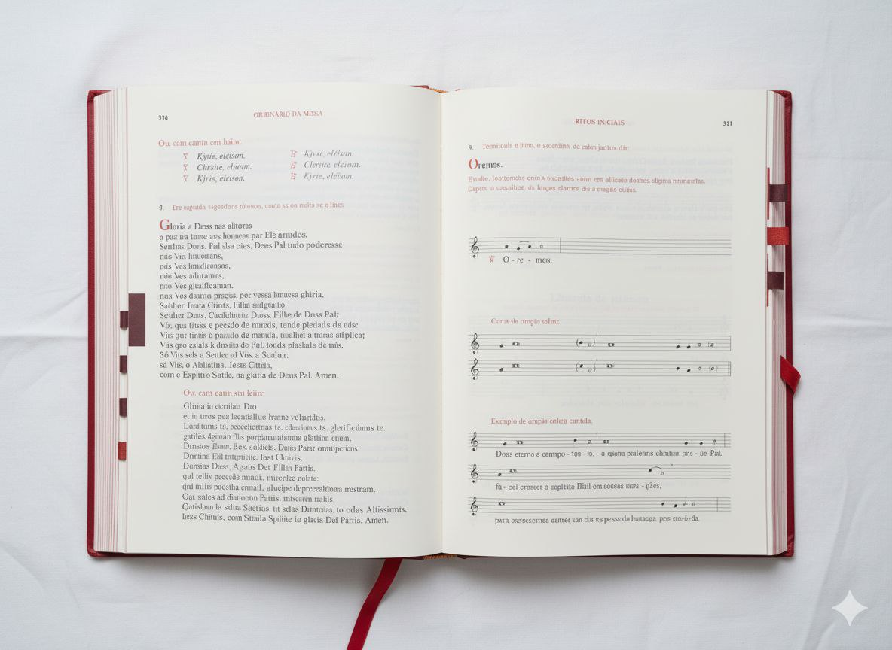

---

# Oração Coleta (IGMR 54)

Oração que conclui os ritos iniciais, reunindo as intenções da assembleia e pedindo a Deus que nos prepare para ouvir a Sua Palavra.

É dirigida ao Pai, por Cristo, no Espírito Santo.

---

# Liturgia da Palavra (IGMR 55–71)

A Liturgia da Palavra é o momento em que Deus fala ao seu povo através das leituras bíblicas.

É composta por textos do Antigo e Novo Testamento, salmos e o Evangelho, culminando na homilia e na profissão de fé. 

Este rito alimenta a fé e prepara os fiéis para a Eucaristia.

Está dividida em várias partes:

* Primeira Leitura

* Salmo Responsorial

* Segunda Leitura

* Evangelho

* Homilia

* Credo/Profissão de Fé

* Oração Universal/dos Fiéis

---

# Credo/Profissão de Fé (IGMR 67-68)

Profissão de fé da comunidade cristã, reafirmando as verdades fundamentais da fé católica. 

Pode ser o Credo Niceno-Constantinopolitano ou o Credo Apostólico (Símbolo dos Apóstolos).

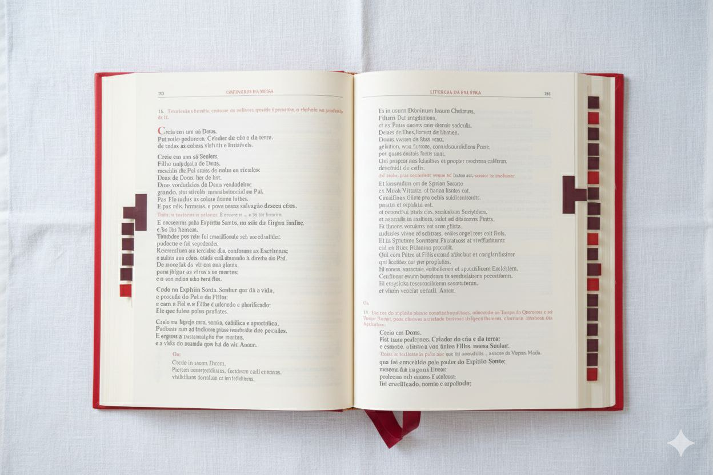

---

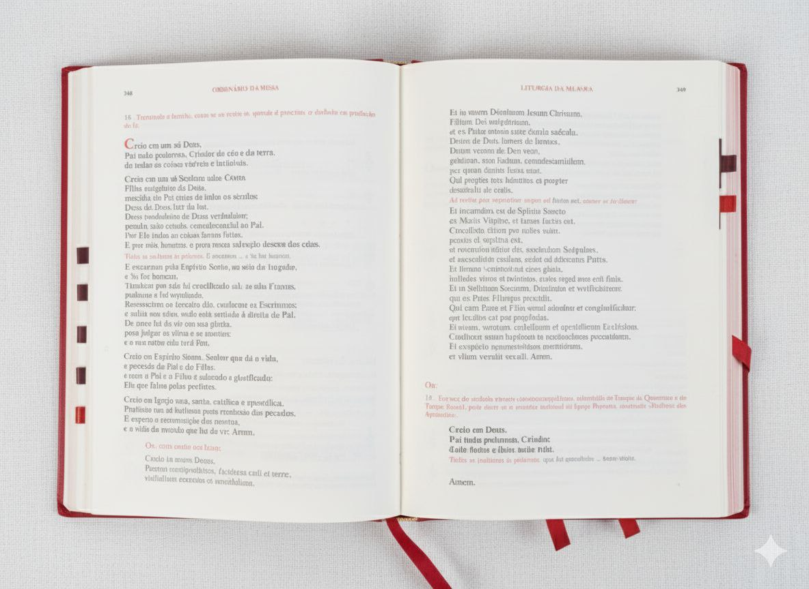

---

# Oração Universal (IGMR 69-71)

Preces da comunidade pelas necessidades da Igreja, do mundo, dos necessitados e da assembleia. Expressa a dimensão comunitária e missionária da fé.

É lida a partir do livro da Oração Universal. Se o livro estiver guardado na credência, deve ser entregue ao sacerdote.

Neste momento também são, habitualmente, lidas as intenções dos fiéis, seja por defuntos ou em ação de graças.

O acólito deve entregar essas intenções ao sacerdote neste momento.

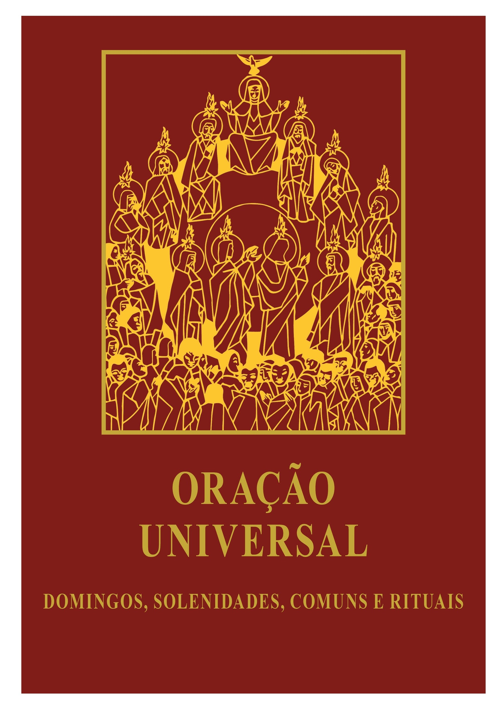

---

# Liturgia Eucarística (IGMR 72–89)

A Liturgia Eucarística é o coração da Missa. 

Nela, os dons de pão e vinho são apresentados, consagrados e distribuídos aos fiéis como Corpo e Sangue de Cristo. 

Este rito renova o sacrifício de Cristo na cruz e une os participantes à sua entrega total ao Pai através do Espírito Santo.

Caso se esteja a usar o Missal da Presidência, o acólito deve mudar para o Missal "completo" nesta parte da Missa, colocando-o sobre o altar, aberto na página com a Oração sobre as Oblatas.

O Missal da Presidência e a respetiva estante devem ser arrumados de forma a não atrapalhar o sacerdote nem o movimento dos acólitos.

--- 

# Oração Sobre as Oblatas (IGMR 77)

Oração sobre os dons apresentados (pão e vinho), pedindo que Deus os aceite e os transforme para nossa salvação em nome de todos os presentes.

---

# Oração Eucarística (IGMR 78–79)

Oração central da Missa, que inclui:

* Prefácio (ação de graças)
* Aclamação/Santo
* Epíclese
* Narrativa da Instituição
* Anamnese
* Oblação
* Intercessões
* Doxologia final

<!--É o momento mais solene da Missa, onde o pão e o vinho deixam de ser pão e vinho e se transformam no Corpo e Sangue de Cristo.-->
<!--Prefácio é a parte inicial da Oração Eucarística, onde se expressa ação de graças e louvor a Deus.-->
<!--Na Epíclese é invocado o Espírito Santo para santificar os dons do pão e do vinho.-->
<!--Na Narrativa da Instituição revivemos as palavras e ações de Jesus na Última Ceia.-->
<!--Anamnese é a recordação do sacrifício de Cristo e a proclamação da sua ressurreição.-->
<!--Oblação é a oferta dos dons consagrados e dos nossos corações a Deus, em união com o sacrifício de Cristo.-->
<!--Nas Intercessões pedimos pela Igreja, pelos vivos e pelos falecidos e por toda a humanidade.-->
<!--Doxologia final é a conclusão da Oração Eucarística. Louvamos a Deus e reconhecemos a obra de Cristo.-->
<!--Doxo: glória; logia: discurso-->

---

---

# Ritos da Comunhão (IGMR 80–89)

* Oração Dominical + Embolismo (IGMR 81)
* Rito da Paz (IGMR 82)
* Fração do Pão (IGMR 83)    
* Comunhão (IGMR 84-89)
  * Ação de Graças/Silêncio de agradecimento (IGMR 88)
  * Oração depois da Comunhão (IGMR 89)

<!--Terminada a oração eucarística passamos aos ritos da Comunhão-->
<!--Muito pode ser dito sobre a oração dominical. Na oração do Pai Nosso pedimos, em particular, pelo pão nosso de cada dia, em particular o pão Eucarístico-->
<!--Embolismo (de embalo) desenvolve a ultima petição do pai nosso (livrai-nos do mal)-->
<!--Rito da Paz: imploramos à unidade da Igreja e exprimimos uns aos outros a comunhão da paz-->
<!--Na fração do pão, o sacerdote parte o pão eucarístico. É um gesto que, nos tempos da Igreja primitiva, designava toda a ação eucarística-->
<!--Comunhão: momento em que os fiéis recebem o Corpo e Sangue de Cristo-->
<!--Ação de graças: momento de silêncio para agradecer a Deus o dom recebido-->
<!--Oração depois da comunhão: completa a oração do povo de Deus e conclui o Rito da Comunhão-->

---

# Oração depois da Comunhão (IGMR 89)

Ação de graças pelos dons recebidos, pedindo que a Eucaristia produza frutos na vida cristã.

Caso se esteja a usar o Missal da Presidência, o acólito deve arrumar o Missal "completo" que está sobre o altar e repor o Missal da Presidência e respetiva estante.\
Deve-se voltar à página própria do tempo ou dos santos, missa comum ou votiva, conforme a marcação da missa do dia.

<!---->

---

# Ritos Finais (IGMR 90)

Encerram a celebração e enviam os fiéis para viverem a fé no dia a dia. É um momento breve, mas essencial, que reforça a missão cristã no mundo.
* Avisos à assembleia
* Bênção Final
* Despedida
* Beijo no altar

---

# Bênção Solene

Em certas celebrações por indicação de uma rubrica ou por preferência do celebrante a bênção final pode ser solene.

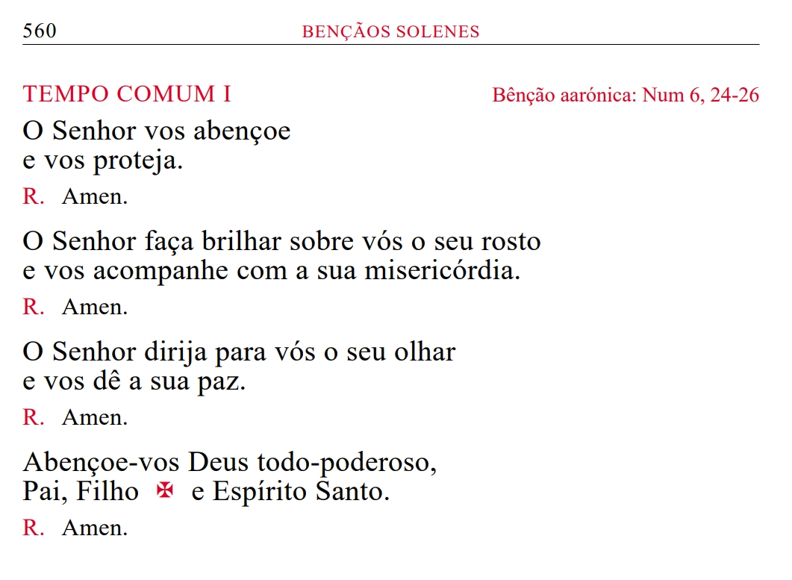

---

# Como marcar o Missal?

A IGMR sugere que o Missal seja marcado de forma a facilitar o acesso rápido às partes essenciais da celebração.

No capítulo VII da IGMR (A escolha da Missa e das suas partes) são dadas orientações sobre a escolha das partes da Missa para diferentes celebrações e tempos litúrgicos.

Mas há uma maneira mais simples...

---

# Diretório Litúrgico

O **Diretório Litúrgico** é um documento oficial da Igreja que indica, para cada dia do ano, os santos celebrados, as leituras, a cor dos paramentos, o prefácio e as orações a usar, bem como outras informações litúrgicas essenciais.

---

---

# Checklist de Marcação do Missal

* Verificar a data da Missa no Diretório Litúrgico e marcar a página própria do Temporal/Santoral, conforme indicado.  
  * Caso indique prefácio próprio e estiver nas mesmas paginas da oração sobre as oblatas, não é necessário assinalar o prefácio; caso contrário, marcar o prefácio a usar. Se disser "prefácio à escolha", pergunta-se ao sacerdote qual usar.
  * Caso na página própria indique ato penitencial, prefácio, bênção, etc, marcar as páginas mencionadas.
* Perguntar qual a Oração Eucarística a usar e marcar a respetiva página (ou guardar na memória e usar a pega no momento devido).  
* Assinalar outros momentos a pedido do sacerdote (ato penitencial ou bênção final específicos, por exemplo).

---

# O Acólito do Missal durante a Celebração

Durante a celebração e com o Missal devidamente marcado, o acólito deve estar **atento aos momentos** em que o sacerdote necessita da passagem de página ou mudança de seção.

Também deve estar vigilante quanto às alturas em que outros livros ou textos, como o da Oração Universal ou as intenções dos fiéis, são necessários para os entregar ao sacerdote com **prontidão e discrição**.

Os movimentos devem ser **lentos, precisos e reverentes** de modo a **não perturbar** a leitura nem distrair a assembleia. É essencial evitar cobrir o texto com as mãos, braços ou mangas.

---

Ao virar as páginas, o acólito deve confirmar se a página aberta é a correta e perceber quais as palavras que precedem a viragem seguinte. Este gesto deve ser feito com **naturalidade, sem pressa, mas com atenção**.

O sacerdote costuma sinalizar a necessidade de viragem com gestos discretos, como recolher as mãos ou fazer uma pausa, mas o acólito deve **procurar antecipar** esses momentos, para isso tem de **conhecer bem o ritmo da celebração**.

As mudanças para outras partes do Missal, feitas através de fitas ou pegas, geralmente oferecem mais tempo para serem executadas. Por exemplo, o final do prefácio é sempre seguido pelo cântico "Santo", o que permite ao acólito ir com calma para a página da Oração Eucarística.

---

# Resumo das mudanças de página/seção do Missal durante uma Missa "normal"

1. Página das orações presidenciais (oração coleta)
1. Página das orações presidenciais (oração sobre as oblatas)
1. Prefácio
1. Oração Eucarística
1. Ritos da Comunhão 
1. Página das orações presidenciais (oração depois da comunhão)
